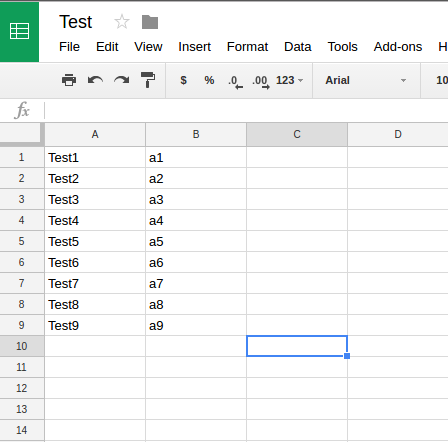
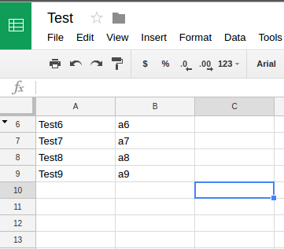
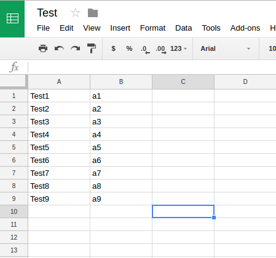
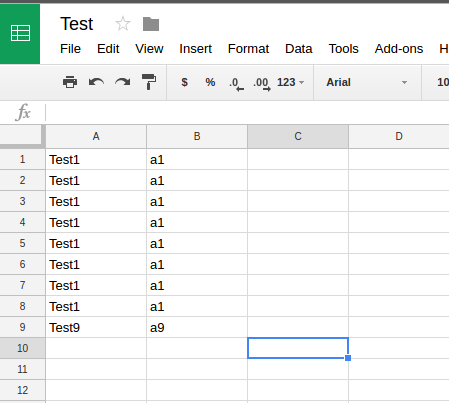

# Functions-GoogleSheets
Some Google sheet functions

Here's an overview of some basic functions:

This is the original sheet without modifications.

Here it is after running the hide row function:

Here it is after running the unhide function:

Here is after running the copy row function:

